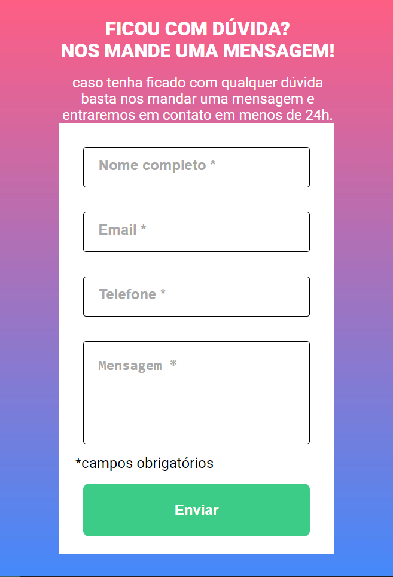
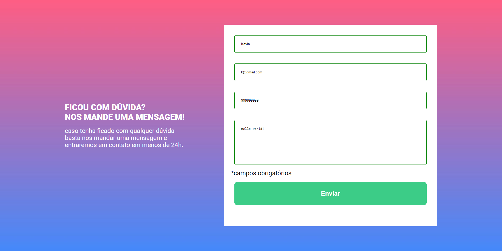
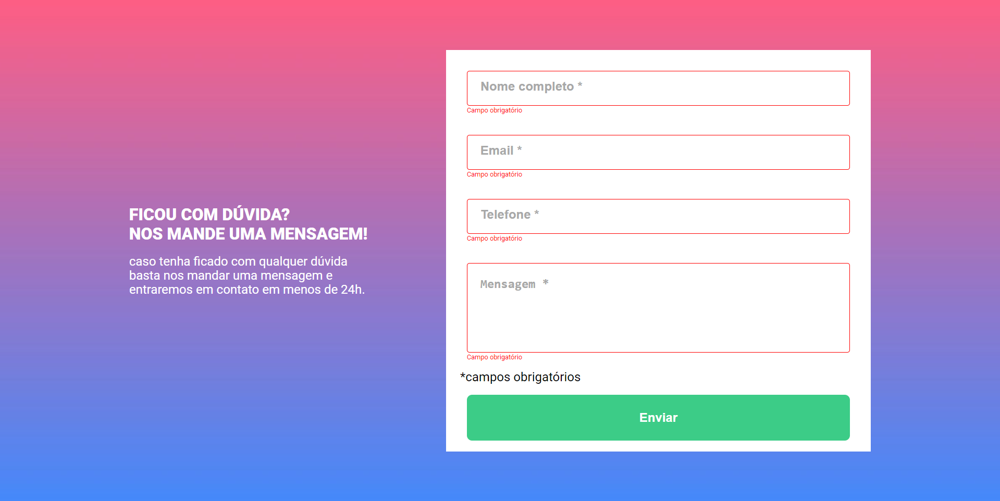

# Desafio intermediário DevQuest - HTML/CSS/JAVASCRIPT

Essa é a solução de um dos desafios presentes no curso DevQuest de nível intermediário! O curso DevQuest nos ajuda a melhorar e capacitar nossas habilidades de programação construíndo projetos baseados na realidade.

## Sumário

- [Visão geral](#overview)
  - [O desafio](#the-challenge)
  - [Screenshot](#screenshot)
  - [Links](#links)
- [Meu processo](#my-process)
  - [Construído com](#built-with)
  - [O que eu aprendi](#what-i-learned)
  - [O que vem agora](#continued-development) 
  - [Recursos úteis](#useful-resources)
- [Autor](#author)

## Visão geral

### O desafio

Os usuários devem estar aptos a:

- Ver o layout de uma seção de dúvidas de uma página em diferentes tamanhos de tela;
- Ver a interatividade dos elementos, que no desafio eram: Ao enviar o formulário, deveria ser verificado se todos os campos estão preenchidos, pois todos eram obrigatórios. Caso algum campo não estivesse preenchido, a caixa ao redor dele ficaria vermelha e apareceria uma mensagem, também em vermelho, dizendo que o campo é obrigatório. Caso todos os campos estiverem preenchidos, as caixas deveriam ficar com as bordas da cor verde.

### Screenshots

 

 

 

 

### Links

- Link do projeto no ar: [Projeto](https://your-solution-url.com)

## Meu processo

### Construído com

- HTML5 semântico
- CSS3
- Flexbox 
- JavaScript
- DOM

### O que aprendi

Aprendi a usar o HTML5 e suas tags semânticas, assim como a estilização no CSS3. Para fazer as interações da página, usei o JavaScript e também o DOM (esse serve para fazermos interações no HTML). De um todo, esse projeto foi muito interessante sinto que consegui aprender muitas coisas novas com ele, dominando tranquilamente a parte de HTML5 e de CSS3, porém fazendo com um pouco de dificuldade ainda o JavaScript.

### O que vem agora

Agora continuarei fazendo o curso DevQuest, como outras vezes já mencionei nos arquivos de README. Estou entrando no quarto mês do curso e consegui fazer 70% do módulo de Front-End. Espero terminar o curso todo até o fim do ano e também começara a aplicar para vagas.

### Recursos úteis

- Primeiramente, fiz muitas pesquisas para a parte de JavaScript, para consultar quando tinha algumas dúvidas ou não lembrava como fazia alguma coisa. Também olhei muito meus resumos, que me ajudaram bastante.

## Autor

- Kevin Desbessell
